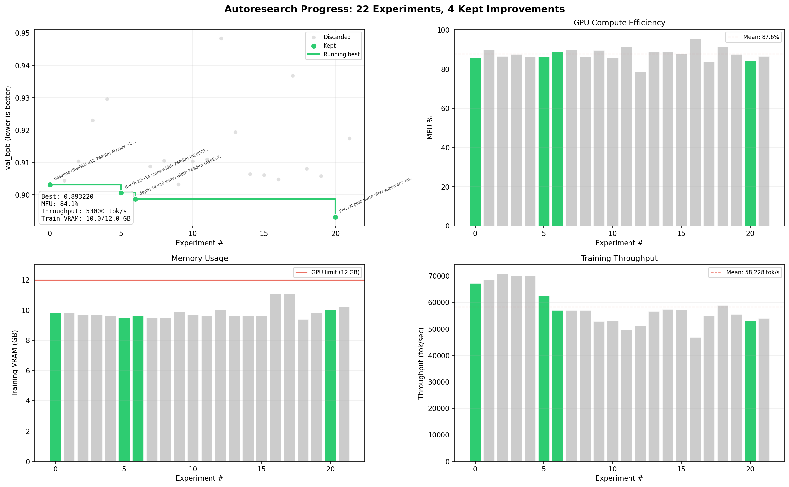

# TrainRTX5070_60Min

> Autonomous LLM pretraining research on a single RTX 5070.



*AI agent runs experiments autonomously: modify code, train for 60 minutes, check if val_bpb improved, keep or discard, repeat. You sleep, it researches.*

## Start the AI agent

```
Read @program.md and @CLAUDE.md. Continue the experiment loop on the autoresearch/mar10 branch. The baseline is already recorded in results.tsv. Start experimenting. Remember to git pull first and do a landscape scan web search before your first experiment.
```

Paste this into Claude Code (with bypass permissions on). Monitor in two PowerShell windows:

```powershell
# Window 1 — training steps (pick one)
Get-Content run.log -Tail 3 -Wait                                          # scrolling
while ($true) { Clear-Host; Get-Content run.log -Tail 5; Start-Sleep 5 }   # fixed dashboard

# Window 2 — experiment results (pick one)
Get-Content results.tsv -Tail 10 -Wait                                          # scrolling
while ($true) { Clear-Host; Get-Content results.tsv -Tail 10; Start-Sleep 30 }  # fixed dashboard
```

## How it works

The AI agent loops forever: change code, train 60 minutes, measure val_bpb (bits per byte), keep if improved, discard if not. Each experiment is logged in `results.tsv` with full metrics (val_bpb, MFU, throughput, VRAM, model size). The progress chart updates automatically.

| Component | Details |
|-----------|---------|
| GPU | RTX 5070 12GB (Blackwell CC 12.0, ~66 TFLOPS BF16) |
| Model | SwiGLU MLP, RoPE, value embeddings, ~200M params (AI evolves this) |
| Dataset | ClimbMix (nvidia/Nemotron-ClimbMix), GPT-2 tokenizer |
| Optimizer | Muon (matrices) + AdamW (embeddings) |
| MFU | ~53-58% (runtime benchmarked, not hardcoded) |
| Time budget | 60 minutes per experiment (~1 experiment/hour) |
| Metric | val_bpb — lower is better |

## Project structure

```
train.py        — model + training loop (AI modifies this)
prepare.py      — data pipeline, tokenizer, evaluation (fairness-locked)
program.md      — experiment loop protocol (AI follows this)
CLAUDE.md       — project context + rules for AI agents
results.tsv     — experiment log (all metrics, all experiments)
plot_results.py — generates progress.png (experiment progress chart)
```

## Setup from scratch

Requirements: RTX 5070, Windows, Python 3.10+, [uv](https://docs.astral.sh/uv/).

```powershell
# Install uv (if needed)
powershell -ExecutionPolicy ByPass -c "irm https://astral.sh/uv/install.ps1 | iex"

# Install dependencies
uv sync

# Download ClimbMix data (~6GB, parallel download)
uv run prepare.py --dataset climbmix

# Smoke test (~2 min first time due to torch.compile, ~30s after)
uv run train.py --smoke-test

# Manual training run (~60 min)
uv run train.py
```

## Design

- **Primary file to modify.** The AI primarily edits `train.py` (model + training loop). `prepare.py` dataloader changes are allowed but fairness-locked metrics are not.
- **Fixed 60-minute budget.** Every experiment gets exactly 60 minutes of training. This makes results comparable regardless of what the AI changes (model size, batch, architecture).
- **Fairness invariants.** Time budget, sequence length, tokenizer, dataset, and eval function are locked. The AI optimizes the model and training, not the measurement.
- **Self-contained.** One GPU, one file, one metric. No distributed training, no complex configs.

## Credits

Originally inspired by the open-source autoresearch concept, adapted for Windows consumer GPUs.

## License

MIT
